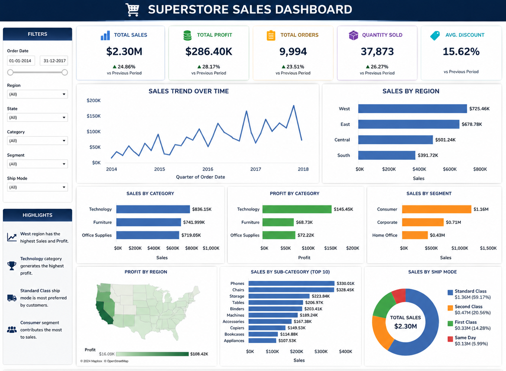

# Superstore Sales Dashboard

## Project Overview
Interactive Superstore Sales Dashboard developed using Tableau, SQL, and Excel to analyze sales performance, profit trends, customer insights, and regional business metrics through dynamic visualizations and KPI reporting.

## Tools Used
- Tableau
- SQL
- Excel

## Dashboard Features
- Sales Trend Analysis
- Profit Analysis
- Regional Performance Insights
- Customer Segment Analysis
- KPI Reporting
- Interactive Filters and Charts

## Key Insights
- Technology category generated the highest sales
- West region achieved maximum profit
- Consumer segment contributed the most revenue

## Dashboard Preview

